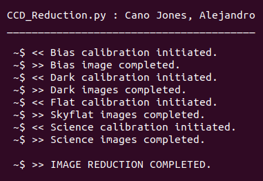

# Photometric catalog of the NGC 6793 Open Cluster

  
   
  
  

<a href="http://simbad.cds.unistra.fr/simbad/sim-basic?Ident=NGC6793&submit=SIMBAD+search">SIMBAD reference</a>

The image reduction process is done following the <a href="http://www.astropy.org/ccd-reduction-and-photometry-guide/v/dev/notebooks/00-00-Preface.html">CCD Data Reduction GUIDE</a>, making use of the (self-made) CCD_Reduction.py scrip. The program takes the needed files fomr the DATA folder, the files are distributed (by type) on the BIAS, DARKS, FLATS and SCIENCE folders. If the script worked as spected, this would be the terminal output

  

(otherwhise, error messages would appear). The program uotput (in adition to a log.txt file) can be found at the Results folder, containing a masterflat.fit file, a DARKS folder (containing masterflats with different exposure times) and SCIENCE folder, which contains the reduced images.

The reduced images where later used to create the photometric catalog, using the SExtractor software. Since the files do not contain a world coordinate system, an astrometry process was made to one of the files using the Astrometry.net online app. The resulting catalogs (one for each filter) were combined to a complete catalog contaning de RA, DEC, apparent magnitudes for the rSDSS, gSDSS and Ha filters, alongside of other data.

Complete procedure, methodology and some results can be found on the PhotometricCatalog_NGC6793.pdf paper.

<!-- START OF LICENSE -->

   
  This work is licensed under a
  <a rel="license" href="http://creativecommons.org/licenses/by-nc-nd/4.0/">Creative Commons Attribution-NonCommercial-NoDerivatives 4.0 International License</a>.

<!-- END OF LICENSE -->
